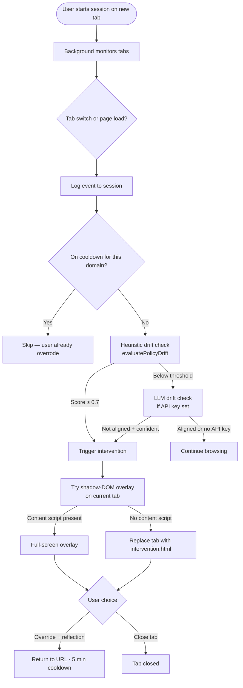
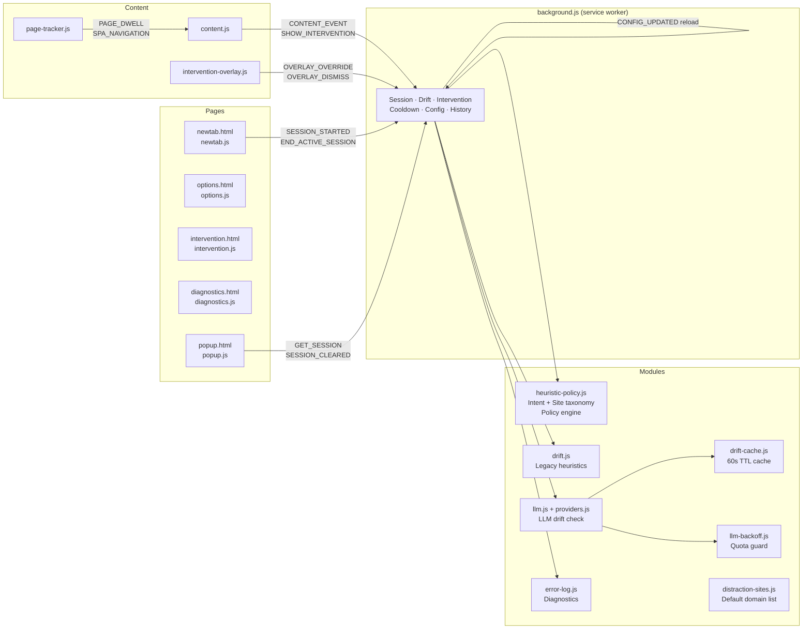
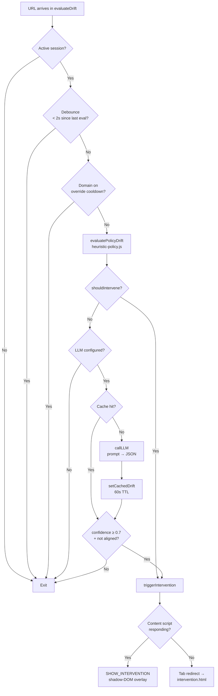

# IntentLock

A Chrome extension (Manifest V3) that enforces your declared browsing intent. You state what you're doing — writing a report, job hunting, deep work — and IntentLock watches every tab, scores drift in real time, and blocks you the moment your browsing stops matching.

**Heuristics run without an API key.** YouTube blocks on `job_search + balanced` with zero AI configuration. LLM drift checking is an optional layer on top.

---

## How it works — overview



---

## Install (developer mode)

1. Clone or download this repo
2. Open Chrome → `chrome://extensions`
3. Enable **Developer mode** (top-right toggle)
4. Click **Load unpacked** → select the repo folder
5. Open a new tab — the IntentLock onboarding wizard appears

> **Loadable folder:** if you keep a separate folder synced from the repo, point Chrome at that instead.

---

## First run — onboarding

Three-step wizard on the new tab page:

| Step | What happens |
|------|-------------|
| **1 — Welcome** | Explains the extension; one click to continue |
| **2 — LLM setup** | Optional: pick an AI provider and paste an API key (skip for heuristics-only mode) |
| **3 — Intent setup** | Pick your intent category (Job Search, Deep Work, Coding, …) and a strictness preset (relaxed / balanced / strict) |

After onboarding, each new tab shows the **session form**: type your specific intent, set an optional time budget, and click **Lock in**.

---

## Architecture



### Component responsibilities

| File | Role |
|------|------|
| `background.js` | Service worker — owns session state, drift pipeline, intervention trigger, cooldown map, history |
| `heuristic-policy.js` | Policy engine — intent taxonomy, site taxonomy (529 domains), drift scoring, policy schema |
| `drift.js` | Legacy keyword-only heuristics (still used for constants; `evaluateHeuristicDrift` kept for reference) |
| `llm.js` | LLM drift check — builds prompt, calls provider, parses `{aligned, confidence}` |
| `providers.js` | Multi-provider abstraction: OpenAI, Gemini, Grok, Ollama, LM Studio, custom |
| `drift-cache.js` | In-memory TTL cache (60 s, 100 entries) keyed by `intent + url + last-5-events` |
| `llm-backoff.js` | Pauses LLM calls for 30 min after quota/rate-limit errors |
| `content.js` | Injected into every page — handles `SHOW_INTERVENTION` and routes `CONTENT_EVENT` |
| `page-tracker.js` | Tracks active dwell time per page; patches `pushState`/`replaceState` for SPAs |
| `intervention-overlay.js` | Shadow-DOM full-screen overlay with Override + Dismiss actions |
| `newtab.js` | Onboarding wizard (3 steps) + session form + active session view |
| `options.js` | Settings: provider config, category policy grid, custom domains, theme, diagnostics |
| `error-log.js` | Stores up to 200 diagnostic entries in `chrome.storage.local` |
| `distraction-sites.js` | Legacy 8-domain default list (used during migration to heuristicPolicy) |

---

## Drift pipeline (detailed)

Every tab switch or page load runs through this pipeline:



### Scoring weights (`evaluatePolicyDrift`)

| Signal | Effect |
|--------|--------|
| Domain policy = `block` + not aligned with intent | Immediate intervene, score 0.95, reason `blocked_category` |
| Domain policy = `allow` + intent aligned | Never block on category alone |
| `customAllowDomains` match | Category block never fires |
| 3+ unrelated events in last 2 min | +0.35 |
| 4+ tab switches in last 2 min | +0.25 |
| 2+ loads of same unaligned domain | +0.20 |
| Warn category + unaligned + dwell ≥ 60 s | +0.20 |
| Warn category + unaligned + dwell ≥ 120 s | Floor score at 0.7 → intervene |
| Any domain + unaligned + dwell ≥ 120 s | Floor score at 0.7 → intervene |
| Threshold | `DRIFT_CONFIDENCE_THRESHOLD = 0.7` |

---

## Heuristic policy engine

See [`docs/heuristic-policy.md`](docs/heuristic-policy.md) for the full reference.

**Intent categories (12):** `job_search`, `deep_work`, `coding`, `learning`, `writing`, `research`, `admin`, `creative`, `health`, `shopping`, `communication`, `entertainment_allowed`

**Site categories (21, 529 domains):** `social_media`, `short_video`, `streaming`, `gaming`, `news`, `forums`, `shopping`, `email`, `messaging`, `job_boards`, `professional_network`, `documentation`, `code_forge`, `ai_tools`, `finance`, `sports`, `adult`, `gambling`, `memes`, `productivity`, `health`, `travel`

**Strictness presets:**

| Preset | Blocks | Warns | Allows |
|--------|--------|-------|--------|
| `strict` | social, short_video, streaming, gaming, forums, memes, gambling | news, shopping, sports, finance | everything else |
| `balanced` | social, short_video, streaming, memes, gambling | gaming, forums, news, shopping, sports | everything else |
| `relaxed` | short_video | social, streaming, gaming, memes, gambling | everything else |

**Category alignment:** `job_search` intent + hostname in `job_boards` or `professional_network` → aligned even without keyword match. Same logic for all 12 intent categories.

---

## LLM providers

Configured in Settings → LLM provider. The API key is stored in `chrome.storage.session` (cleared on browser close — never written to disk).

| Provider | ID | API style | Local? |
|----------|----|-----------|--------|
| OpenAI | `openai` | OpenAI chat/completions | No |
| Google Gemini | `gemini` | Gemini generateContent | No |
| Grok (xAI) | `grok` | OpenAI-compatible | No |
| Ollama | `ollama` | Ollama /api/chat | Yes |
| LM Studio | `lmstudio` | OpenAI-compatible | Yes |
| Custom | `custom` | OpenAI / Gemini / Ollama | Either |

LLM is **optional**. Without a key, only heuristic scoring runs. With a key, LLM provides a second opinion only when heuristics score below the threshold.

---

## Settings

Open via the extension's options page (right-click icon → Options, or Settings button in popup).

| Section | What it controls |
|---------|-----------------|
| **LLM provider** | Provider, API key, model, endpoint; advanced: auth type, base URL |
| **Site categories** | Per-category block/warn/allow radio grid (21 categories); custom always-block and always-allow domain lists |
| **Test intervention** | Fires a test intervention on your current tab without real drift |
| **Privacy & data** | Enable/disable behavior tracking; export session history as JSON; delete all data |
| **Diagnostics** | View last 200 errors (API failures, quota limits, validation issues) |
| **Appearance** | Auto / Dark / Light theme |

---

## Storage schema

See [`docs/storage-schema.md`](docs/storage-schema.md) for full field-by-field reference.

Key `chrome.storage.local` entries:

| Key | Type | Description |
|-----|------|-------------|
| `activeSession` | object | Current session: intent, events[], isActive, timeBudget, startTime |
| `heuristicPolicy` | object | v1 policy schema: intentCategoryId, strictness, categoryPolicies, customBlockDomains, customAllowDomains |
| `sessionHistory` | array | Completed sessions (summarised: id, intent, driftCount, totalEvents) |
| `llmProviderConfig` | object | Provider ID, model, endpoint, auth type |
| `trackingEnabled` | boolean | Whether page dwell events are recorded |
| `theme` | string | `'auto'` \| `'dark'` \| `'light'` |
| `errorLog` | array | Up to 200 diagnostic entries |
| `interventionState` | object | Ephemeral: reason, originalUrl, mode while intervention is active |
| `overrideCooldowns` | array | `[domain, expiryTimestamp]` pairs |

`chrome.storage.session` (cleared on browser close):

| Key | Description |
|-----|-------------|
| `openaiApiKey` / `llmApiKey` | API key — never persisted to disk |

---

## Testing

```bash
node --test tests/heuristic-policy.test.mjs   # 48 tests — policy engine
node --test tests/background.test.mjs          # 2 tests  — service worker helpers
node --test tests/drift.test.mjs               # heuristic drift scoring
node --test tests/drift-cache.test.mjs         # TTL cache
node --test tests/llm-backoff.test.mjs         # quota backoff
node --test tests/providers.test.mjs           # provider config validation
node --test tests/page-tracker.test.mjs        # dwell tracking + SPA detection
node --test tests/error-log.test.mjs           # diagnostic log
node --test tests/static-smoke.test.mjs        # manifest + asset integrity
node --test tests/*.mjs                        # all tests
```

Uses Node's built-in `node:test` + `assert/strict`. No build step, no test runner to install.

---

## Development

See [`docs/development.md`](docs/development.md) for full setup, reload workflow, and contribution guide.

Quick start:
```bash
# No build step — ES modules loaded directly by Chrome
# Load the folder in chrome://extensions → Developer mode → Load unpacked

# After any JS change: Extensions page → refresh icon on the IntentLock card
# After manifest.json change: same as above
# After content.js change: also reload the affected tab
```

---

## Version history

See [CHANGELOG.md](CHANGELOG.md).

| Version | Highlight |
|---------|-----------|
| 1.5.0 | Heuristic self-setup engine — category-aware policy, onboarding step 3, settings grid |
| 1.4.0 | In-page shadow-DOM overlay, dwell tracking, SPA support, LLM confidence gate |
| 1.2.1 | Secure session key storage, onboarding wizard, cooldown tests |
| 1.2.0 | Multi-provider LLM (OpenAI, Gemini, Grok, Ollama, LM Studio, custom) |
| 1.1.0 | Popup, tab groups, keyboard shortcut (`⌘⇧L`) |
