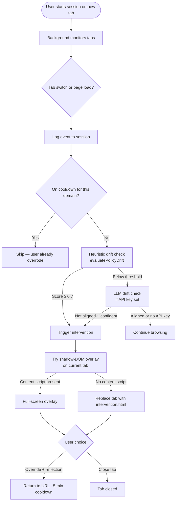
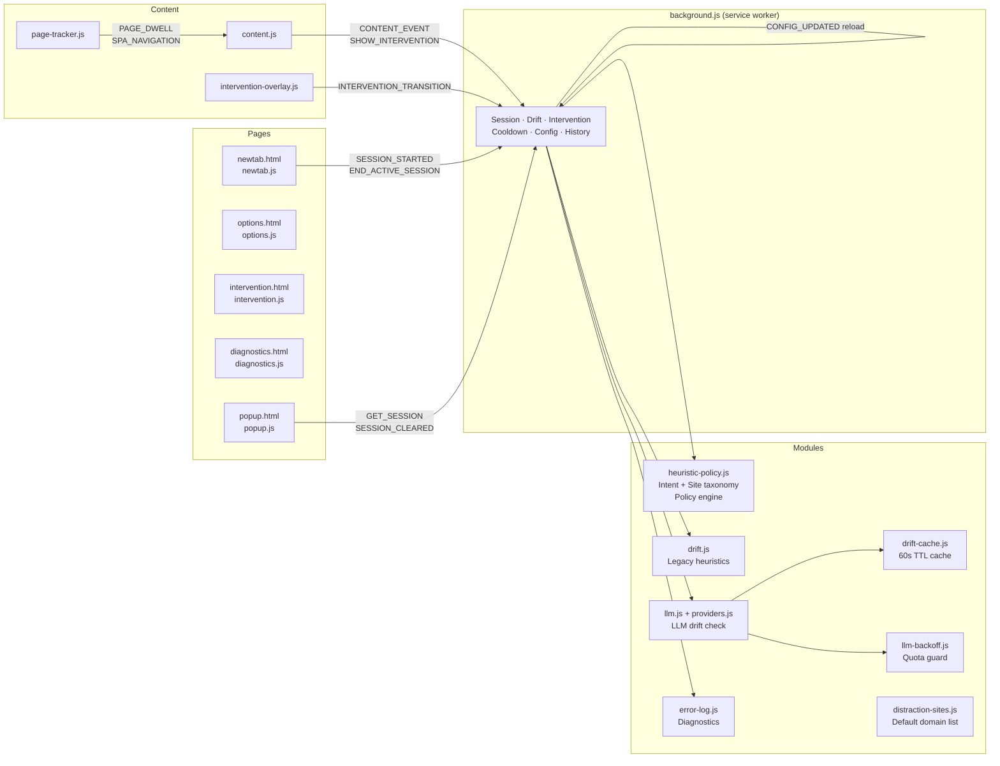
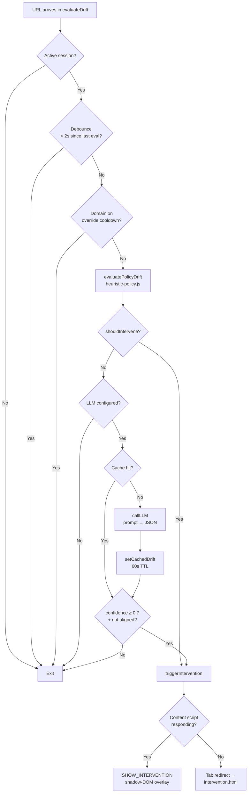

# IntentLock

Declare what you are doing. IntentLock watches your tabs and locks the page when you drift.

Heuristics run with no API key. An optional AI provider in Settings is a second opinion only.

## Install (about two minutes)

1. Open [Releases](https://github.com/harshabala/IntentLock/releases/latest) and download the latest `IntentLock-*.zip`.
2. Unzip it.
3. Chrome → `chrome://extensions` → enable **Developer mode**.
4. **Load unpacked** → select the unzipped folder.
5. Open a new tab. Declare your intent. → set default policy → **Lock in** an intent.

From source: clone this repo, load the repo folder unpacked, then `npm test`.

## First run

1. Declare your intent.
2. Default intent type + strictness (you can change this later in Settings)
3. Type this session's intent and optional time budget. Click **Lock in**.

AI providers are not part of setup. Add one in **Settings** if you want a second drift check.

## What it does

- Blocks the page when you leave your declared intent
- Requires a written reflection to continue, or Close tab / End session
- Stores session data only on this device

## What it does not do

- No accounts, cloud sync, or telemetry
- No habit dashboard or rewards
- No Chrome Web Store listing yet (use the GitHub Release zip)

## Privacy

See [docs/privacy-policy.md](docs/privacy-policy.md). Optional remote LLM providers receive minimized intent and origin-only context when you configure a key.

## License

[MIT](LICENSE) © 2026 Harsha Balakrishnan

---

## How it works (technical)


```mermaid
flowchart TD
    A([User starts session on new tab]) --> B[Background monitors tabs]
    B --> C{Tab switch or page load?}
    C --> D[Log event to session]
    D --> E{On cooldown for this domain?}
    E -- Yes --> F[Skip — user already overrode]
    E -- No --> G[Heuristic drift check\nevaluatePolicyDrift]
    G -- Score ≥ 0.7 --> I[Trigger intervention]
    G -- Below threshold --> H[LLM drift check\nif API key set]
    H -- Not aligned + confident --> I
    H -- Aligned or no API key --> J[Continue browsing]
    I --> K[Try shadow-DOM overlay\non current tab]
    K -- Content script present --> L[Full-screen overlay]
    K -- No content script --> M[Replace tab with intervention.html]
    L --> N{User choice}
    M --> N
    N -- Override + reflection --> O[Return to URL · 5 min cooldown]
    N -- Close tab --> P[Tab closed]
```

### First-run onboarding (technical)

Two-step wizard on the new tab page, then the session form:

| Step | What happens |
|------|-------------|
| **1 — Declare your intent.** | Explains the extension; one click to continue |
| **2 — Default policy** | Pick your intent category (Job Search, Deep Work, Coding, …) and a strictness preset (relaxed / balanced / strict) |

After onboarding, each new tab shows the **session form**: type your specific intent, set an optional time budget, and click **Lock in**. AI providers are configured later in Settings, not during onboarding.

### Architecture


```mermaid
graph LR
    subgraph Pages
        NT[newtab.html\nnewtab.js]
        OPT[options.html\noptions.js]
        INT[intervention.html\nintervention.js]
        DIAG[diagnostics.html\ndiagnostics.js]
        POP[popup.html\npopup.js]
    end

    subgraph Content
        CS[content.js]
        PT[page-tracker.js]
        OV[intervention-overlay.js]
    end

    subgraph Background["background.js (service worker)"]
        BG[Session · Drift · Intervention\nCooldown · Config · History]
    end

    subgraph Modules
        HP[heuristic-policy.js\nIntent + Site taxonomy\nPolicy engine]
        DR[drift.js\nLegacy heuristics]
        LLM[llm.js + providers.js\nLLM drift check]
        DC[drift-cache.js\n60s TTL cache]
        EL[error-log.js\nDiagnostics]
        LB[llm-backoff.js\nQuota guard]
        DS[distraction-sites.js\nDefault domain list]
    end

    CS -->|CONTENT_EVENT\nSHOW_INTERVENTION| BG
    PT -->|PAGE_DWELL\nSPA_NAVIGATION| CS
    OV -->|INTERVENTION_TRANSITION| BG
    NT -->|SESSION_STARTED\nEND_ACTIVE_SESSION| BG
    POP -->|GET_SESSION\nSESSION_CLEARED| BG
    BG -->|CONFIG_UPDATED reload| BG
    BG --> HP
    BG --> DR
    BG --> LLM
    LLM --> DC
    LLM --> LB
    BG --> EL
```

### Component responsibilities

| File | Role |
|------|------|
| `background.js` | Service worker — owns session state, drift pipeline, intervention trigger, cooldown map, history |
| `heuristic-policy.js` | Policy engine — intent taxonomy, site taxonomy (529 domains), drift scoring, policy schema |
| `drift.js` | Legacy keyword-only heuristics (still used for constants; `evaluateHeuristicDrift` kept for reference) |
| `llm.js` | LLM drift check — builds prompt, calls provider, parses `{aligned, confidence}` |
| `providers.js` | Multi-provider abstraction: OpenAI, Gemini, Grok, Ollama, LM Studio, custom |
| `drift-cache.js` | In-memory TTL cache (60 s, 100 entries) keyed by `intent + url + last-5-events` |
| `llm-backoff.js` | Pauses LLM calls for 30 min after quota/rate-limit errors |
| `content.js` | Injected into every page — handles `SHOW_INTERVENTION` and routes `CONTENT_EVENT` |
| `page-tracker.js` | Tracks active dwell time per page; patches `pushState`/`replaceState` for SPAs |
| `intervention-overlay.js` | Shadow-DOM full-screen overlay with Override + Dismiss actions |
| `newtab.js` | Onboarding wizard (welcome + default policy) + session form + active session view |
| `options.js` | Settings: provider config, category policy grid, custom domains, theme, diagnostics |
| `error-log.js` | Stores up to 200 diagnostic entries in `chrome.storage.local` |
| `distraction-sites.js` | Legacy 8-domain default list (used during migration to heuristicPolicy) |

### Drift pipeline (detailed)

Every tab switch or page load runs through this pipeline:


```mermaid
flowchart TD
    A[URL arrives in evaluateDrift] --> B{Active session?}
    B -- No --> Z[Exit]
    B -- Yes --> C{Debounce\n< 2s since last eval?}
    C -- Yes --> Z
    C -- No --> D{Domain on\noverride cooldown?}
    D -- Yes --> Z
    D -- No --> E[evaluatePolicyDrift\nheuristic-policy.js]
    E --> F{shouldIntervene?}
    F -- Yes --> G[triggerIntervention]
    F -- No --> H{LLM configured?}
    H -- No --> Z
    H -- Yes --> I{Cache hit?}
    I -- Yes --> J{confidence ≥ 0.7\n+ not aligned?}
    I -- No --> K[callLLM\nprompt → JSON]
    K --> L[setCachedDrift\n60s TTL]
    L --> J
    J -- Yes --> G
    J -- No --> Z
    G --> M{Content script\nresponding?}
    M -- Yes --> N[SHOW_INTERVENTION\nshadow-DOM overlay]
    M -- No --> O[Tab redirect →\nintervention.html]
```

### Scoring weights (`evaluatePolicyDrift`)

| Signal | Effect |
|--------|--------|
| Domain policy = `block` + not aligned with intent | Immediate intervene, score 0.95, reason `blocked_category` |
| Domain policy = `allow` + intent aligned | Never block on category alone |
| `customAllowDomains` match | Category block never fires |
| 3+ unrelated events in last 2 min | +0.35 |
| 4+ tab switches in last 2 min | +0.25 |
| 2+ loads of same unaligned domain | +0.20 |
| Warn category + unaligned + dwell ≥ 60 s | +0.20 |
| Warn category + unaligned + dwell ≥ 120 s | Floor score at 0.7 → intervene |
| Any domain + unaligned + dwell ≥ 120 s | Floor score at 0.7 → intervene |
| Threshold | `DRIFT_CONFIDENCE_THRESHOLD = 0.7` |

### Heuristic policy engine

See [`docs/heuristic-policy.md`](docs/heuristic-policy.md) for the full reference.

**Intent categories (12):** `job_search`, `deep_work`, `coding`, `learning`, `writing`, `research`, `admin`, `creative`, `health`, `shopping`, `communication`, `entertainment_allowed`

**Site categories (21, 529 domains):** `social_media`, `short_video`, `streaming`, `gaming`, `news`, `forums`, `shopping`, `email`, `messaging`, `job_boards`, `professional_network`, `documentation`, `code_forge`, `ai_tools`, `finance`, `sports`, `adult`, `gambling`, `memes`, `productivity`, `health`, `travel`

**Strictness presets:**

| Preset | Blocks | Warns | Allows |
|--------|--------|-------|--------|
| `strict` | social, short_video, streaming, gaming, forums, memes, gambling | news, shopping, sports, finance | everything else |
| `balanced` | social, short_video, streaming, memes, gambling | gaming, forums, news, shopping, sports | everything else |
| `relaxed` | short_video | social, streaming, gaming, memes, gambling | everything else |

**Category alignment:** `job_search` intent + hostname in `job_boards` or `professional_network` → aligned even without keyword match. Same logic for all 12 intent categories.

### LLM providers

Configured in Settings → LLM provider. The API key is stored in `chrome.storage.session` when available (cleared on browser close), with a local fallback only when session storage is unavailable. Remote providers receive minimized intent and origin-only context.

| Provider | ID | API style | Local? |
|----------|----|-----------|--------|
| OpenAI | `openai` | OpenAI chat/completions | No |
| Google Gemini | `gemini` | Gemini generateContent | No |
| Grok (xAI) | `grok` | OpenAI-compatible | No |
| Ollama | `ollama` | Ollama /api/chat | Yes |
| LM Studio | `lmstudio` | OpenAI-compatible | Yes |
| Custom | `custom` | OpenAI / Gemini / Ollama | Either |

LLM is **optional**. Without a key, only heuristic scoring runs. With a key, LLM provides a second opinion only when heuristics score below the threshold.

### Settings

Open via the extension's options page (right-click icon → Options, or Settings button in popup).

| Section | What it controls |
|---------|-----------------|
| **LLM provider** | Provider, API key, model, endpoint; advanced: auth type, base URL |
| **Site categories** | Per-category block/warn/allow radio grid (21 categories); custom always-block and always-allow domain lists |
| **Test intervention** | Fires a test intervention on your current tab without real drift |
| **Privacy & data** | Enable/disable behavior tracking; export session history as JSON; delete all data |
| **Diagnostics** | View last 200 errors (API failures, quota limits, validation issues) |
| **Appearance** | Auto / Dark / Light theme |

### Storage schema

See [`docs/storage-schema.md`](docs/storage-schema.md) for full field-by-field reference.

Key `chrome.storage.local` entries:

| Key | Type | Description |
|-----|------|-------------|
| `activeSession` | object | Current session: intent, events[], isActive, timeBudget, startTime |
| `heuristicPolicy` | object | v1 policy schema: intentCategoryId, strictness, categoryPolicies, customBlockDomains, customAllowDomains |
| `sessionHistory` | array | Completed sessions (summarised: id, intent, driftCount, totalEvents) |
| `llmProviderConfig` | object | Provider ID, model, endpoint, auth type |
| `trackingEnabled` | boolean | Whether page dwell events are recorded |
| `theme` | string | `'auto'` \| `'dark'` \| `'light'` |
| `errorLog` | array | Up to 200 diagnostic entries |
| `interventionState` | object | Ephemeral: reason, originalUrl, mode while intervention is active |
| `overrideCooldowns` | array | `[domain, expiryTimestamp]` pairs |

`chrome.storage.session` (cleared on browser close when available):

| Key | Description |
|-----|-------------|
| `openaiApiKey` / `llmApiKey` | API key — never persisted to disk |

### Testing

```bash
node --test tests/heuristic-policy.test.mjs   # 48 tests — policy engine
node --test tests/background.test.mjs          # 2 tests  — service worker helpers
node --test tests/drift.test.mjs               # heuristic drift scoring
node --test tests/drift-cache.test.mjs         # TTL cache
node --test tests/llm-backoff.test.mjs         # quota backoff
node --test tests/providers.test.mjs           # provider config validation
node --test tests/page-tracker.test.mjs        # dwell tracking + SPA detection
node --test tests/error-log.test.mjs           # diagnostic log
node --test tests/static-smoke.test.mjs        # manifest + asset integrity
npm test                                        # all tests
npm run verify:static                           # static/runtime/release checks
```

Uses Node's built-in `node:test` + `assert/strict`. No dependencies or test runner to install.

To validate and build a release artifact locally:

```bash
npm run validate:version -- v1.5.1
npm run package
```

The package command creates a deterministic ZIP containing only the extension runtime allowlist. Tests, docs, and development files stay out of the release artifact.

### Development

See [`docs/development.md`](docs/development.md) for full setup, reload workflow, and contribution guide.

Quick start:
```bash
# No build step — ES modules loaded directly by Chrome
# Load the folder in chrome://extensions → Developer mode → Load unpacked

# After any JS change: Extensions page → refresh icon on the IntentLock card
# After manifest.json change: same as above
# After content.js change: also reload the affected tab
```

### Version history

See [CHANGELOG.md](CHANGELOG.md).

| Version | Highlight |
|---------|-----------|
| 1.5.0 | Heuristic self-setup engine — category-aware policy, onboarding step 3, settings grid |
| 1.4.0 | In-page shadow-DOM overlay, dwell tracking, SPA support, LLM confidence gate |
| 1.2.1 | Secure session key storage, onboarding wizard, cooldown tests |
| 1.2.0 | Multi-provider LLM (OpenAI, Gemini, Grok, Ollama, LM Studio, custom) |
| 1.1.0 | Popup, tab groups, keyboard shortcut (`⌘⇧L`) |
