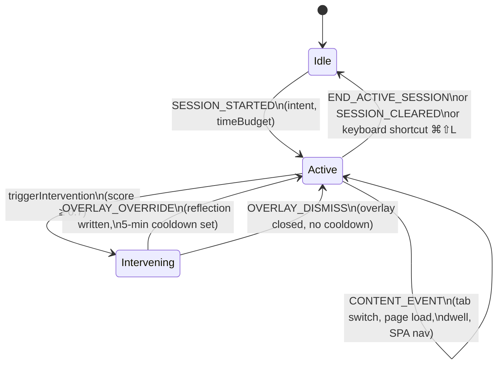
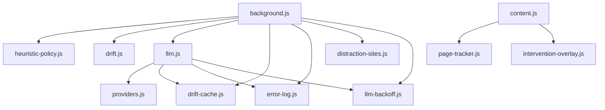

# Architecture

IntentLock is a Chrome MV3 extension. No build step, no bundler — ES modules loaded directly. Every file that runs in the extension context is a plain `.js` ES module.

---

## Process model

Chrome MV3 has three separate JavaScript environments that cannot share memory:

```
┌─────────────────────────────────────────────────────┐
│  Service Worker (background.js)                     │
│  Owns: session state, drift pipeline, history       │
│  Lifetime: terminated when idle, revived on events  │
└────────────┬────────────────────────────────────────┘
             │ chrome.runtime.sendMessage / onMessage
  ┌──────────┴──────────┐          ┌───────────────────┐
  │  Extension Pages    │          │  Content Scripts  │
  │  newtab.js          │          │  content.js       │
  │  options.js         │          │  page-tracker.js  │
  │  popup.js           │          │  intervention-    │
  │  intervention.js    │          │  overlay.js       │
  │  diagnostics.js     │          │                   │
  └─────────────────────┘          └───────────────────┘
             │                              │
             └──────────────────────────────┘
                   chrome.storage.local (shared)
```

All coordination goes through **messages** (`chrome.runtime.sendMessage`) or **`chrome.storage.local`**. There is no shared in-memory state between environments.

---

## Message protocol

All messages are plain objects `{ type: string, ...payload }`. The service worker handles these types:

| Message type | Sender | What it does |
|-------------|--------|-------------|
| `SESSION_STARTED` | newtab.js | Persists new session to storage, starts time-budget alarm, clears drift cache |
| `END_ACTIVE_SESSION` | newtab.js / popup.js | Finalises session, appends to `sessionHistory`, clears state |
| `SESSION_CLEARED` | newtab.js / options.js | Removes active session, clears alarms and cooldowns |
| `GET_SESSION` | popup.js / newtab.js | Returns `activeSession` from storage |
| `CONFIG_UPDATED` | options.js | Calls `reloadConfig()` — re-reads all settings from storage |
| `CONTENT_EVENT` | content.js | Routes tab/dwell/SPA events into the active session's event log |
| `OVERLAY_OVERRIDE` | content.js | Records override event, sets domain cooldown, hides overlay |
| `OVERLAY_DISMISS` | content.js | Clears `interventionState`, sends `HIDE_INTERVENTION` back to tab |
| `OVERRIDE_INTERVENTION` | intervention.js | Tab-replacement override path — same effect as `OVERLAY_OVERRIDE` |
| `TEST_INTERVENTION` | options.js | Fires a test intervention on the current active tab |
| `LOG_ERROR` | any page | Appends entry to `errorLog` in storage via `error-log.js` |

Content scripts receive:

| Message type | Sender | What it does |
|-------------|--------|-------------|
| `SHOW_INTERVENTION` | background.js | Mounts shadow-DOM overlay via `intervention-overlay.js` |
| `HIDE_INTERVENTION` | background.js | Unmounts overlay |

---

## Session lifecycle



A session object (`activeSession`) stored in `chrome.storage.local`:

```js
{
  id: string,           // uuid
  intent: string,       // user's declared intent
  startTime: number,    // Date.now()
  endTime: number,      // set on end
  isActive: boolean,
  timeBudget: number | null,   // minutes, null = unlimited
  events: Array<{
    actionType: 'TAB_SWITCH' | 'PAGE_LOAD' | 'PAGE_DWELL' | 'SPA_NAVIGATION' | 'OVERRIDE',
    url: string,
    timestamp: number,
    dwellMs?: number,   // PAGE_DWELL only
    reflection?: string // OVERRIDE only
  }>
}
```

---

## Service worker startup

The service worker can be terminated and restarted at any time by Chrome. On every revival:

1. `loadConfig()` reads `chrome.storage.local` — active session, heuristicPolicy, distractionSites, trackingEnabled, overrideCooldowns
2. `migrateLlmStorage()` — moves API key from local to session storage if it was left behind
3. Registers `chrome.tabs.onActivated`, `onUpdated`, `onRemoved`, `onCreated` listeners
4. Registers `chrome.alarms.onAlarm` for time-budget enforcement
5. Registers `chrome.commands.onCommand` for `toggle-session` shortcut

State that must survive worker termination is stored in `chrome.storage.local`. In-memory caches (`drift-cache.js`, `llm-backoff.js`, `overrideCooldowns` Map) are rebuilt from storage on reload.

---

## Content script flow

`content.js` is injected at `document_idle` into every `http(s)://` page. It:

1. Creates a `PageTracker` (from `page-tracker.js`) that measures active dwell time and detects SPA navigations
2. Forwards `PAGE_DWELL`, `SPA_NAVIGATION`, `PAGE_LOAD`, `TAB_SWITCH` events to the background as `CONTENT_EVENT`
3. Listens for `SHOW_INTERVENTION` → mounts the shadow-DOM overlay
4. Listens for `HIDE_INTERVENTION` → unmounts the overlay

The overlay (`intervention-overlay.js`) runs entirely inside a shadow root. It has its own scoped CSS and cannot be styled or blocked by the host page.

---

## Drift pipeline internals

```
CONTENT_EVENT received
  └─ handleContentEvent(payload, tabId)
       └─ session.events.push(event)
       └─ evaluateDrift(url, tabId)
            ├─ [debounce] skip if same URL within 2 s
            ├─ [cooldown] skip if domain in overrideCooldowns
            ├─ evaluatePolicyDrift({ intent, url, events, policy, now })
            │    ├─ parseUrl → hostname
            │    ├─ resolveDomainPolicy(hostname, policy)
            │    │    ├─ customAllowDomains → 'allow' (wins)
            │    │    ├─ customBlockDomains → 'block' (wins)
            │    │    └─ categoryPolicies[DOMAIN_TO_CATEGORY[hostname]]
            │    ├─ block + not aligned → { shouldIntervene: true, score: 0.95 }
            │    ├─ allow + aligned     → { shouldIntervene: false }
            │    └─ behavioral scoring (see scoring table in README)
            │
            ├─ if shouldIntervene → triggerIntervention(reasonLabel, tabId)
            │
            └─ else → checkDriftLLM(intent, url, events)
                  ├─ getCachedDrift(key) → return if hit
                  ├─ getLlmConfig() → if not configured, return aligned=true
                  ├─ isLlmBackedOff() → if backed off, skip
                  ├─ callProvider(prompt) → { aligned, confidence }
                  ├─ setCachedDrift(key, result, 60s TTL)
                  └─ if !aligned + confidence ≥ 0.7 → triggerIntervention(...)
```

### Intervention execution

```
triggerIntervention(reason, tabId)
  └─ captureAndShow(tabId)
       └─ tryOverlayThenFallback(tabId, originalUrl, intent)
            ├─ chrome.storage.local.set({ interventionState })
            ├─ chrome.tabs.sendMessage(tabId, SHOW_INTERVENTION)
            │    ├─ success → shadow-DOM overlay shown on page
            │    └─ error / no response → showTabReplacement(tabId)
            └─ showTabReplacement
                 └─ chrome.tabs.update(tabId, { url: 'intervention.html' })
```

---

## Module dependency graph



No circular dependencies. `heuristic-policy.js` and `drift.js` are pure (no Chrome API calls) and fully testable with Node.

---

## Error handling

All errors that affect the user are routed through `error-log.js`:

- API failures → `ERROR_TYPES.API` with HTTP status, provider ID, classified message
- Config issues → `ERROR_TYPES.CONFIG`
- Storage failures → `ERROR_TYPES.STORAGE`
- Runtime errors → `ERROR_TYPES.RUNTIME`

Errors are stored in `chrome.storage.local.errorLog` (capped at 200 entries) and viewable in Settings → Diagnostics.

**Fail-open rule:** a bad or missing `heuristicPolicy` in storage never throws — `background.js` falls back to `buildDefaultPolicy('deep_work', 'balanced')` inline.

---

## Permissions

Declared in `manifest.json`:

| Permission | Why |
|-----------|-----|
| `tabs` | Monitor tab activation and URL changes |
| `storage` | Persist session, policy, history, config |
| `idle` | Detect when the user is idle (3 min threshold) — pauses dwell accumulation |
| `tabGroups` | Optionally group tabs during active sessions |
| `https://*/*` `http://*/*` | Inject content scripts into web pages |
